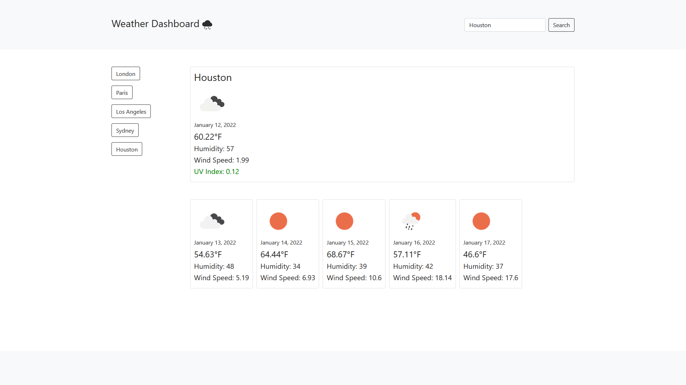

# Description

In this assignment, our task was to use the [OpenWeather One Call API](https://openweathermap.org/api/one-call-api) to retrieve weather data for cities.

When the user searches for a city, they are presented with the city name, an icon representation of weather conditions, the date, the temperature, the humidity, the wind speed, and the UV index (color-coded to favorable, moderate, or severe conditions).

The user is also presented with a 5-day forecast that displays an icon representation of weather conditions, the date, the temperature, the humidity, and the wind speed.

City searches are saved to local storage and are listed on the page as a button. If the user selects a city button, that city's weather information will be loaded.

HTML | CSS | Bootstrap | Javascript

# Screenshot

# Link

(https://eriksvetlik.github.io/weatherdashboard/)
